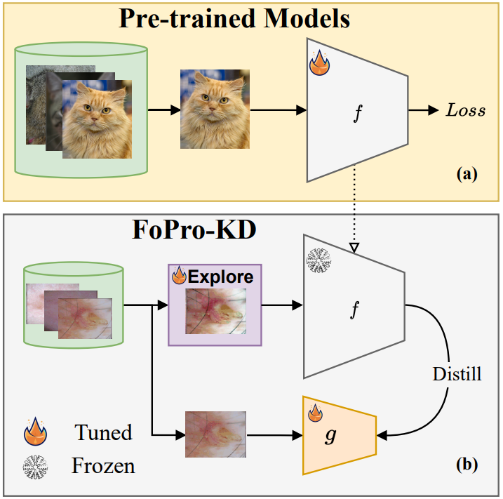

# FoPro-KD: Fourier Prompted Effective Knowledge Distillation for Long-Tailed Medical Image Recognition

## Abstract
Representational transfer from publicly available models is a promising technique for improving medical image classification, especially in long-tailed datasets with rare diseases. However, existing methods often overlook the frequency-dependent behavior of these models, thereby limiting their effectiveness in transferring representations and generalizations to rare diseases. In this paper, we propose FoPro-KD, a novel framework that leverages the power of frequency patterns learned from frozen pre-trained models to enhance their transferability and compression, presenting a few unique insights: 1) We demonstrate that leveraging representations from publicly available pre-trained models can substantially improve performance, specifically for rare classes, even when utilizing representations from a smaller pre-trained model. 2) We observe that pre-trained models exhibit frequency preferences, which we explore using our proposed Fourier Prompt Generator (FPG), allowing us to manipulate specific frequencies in the input image, enhancing the discriminative representational transfer. 3) By amplifying or diminishing these frequencies in the input image, we enable Effective Knowledge Distillation (EKD). EKD facilitates the transfer of knowledge from pre-trained models to smaller models. Through extensive experiments in long-tailed gastrointestinal image recognition and skin lesion classification, where rare diseases are prevalent, our FoPro-KD framework outperforms existing methods, enabling more accessible medical models for rare disease classification. 


<!-- <p></p> -->
<br  clear="left"/>

### Code Base

This repository includes the training, validation, and held-out testing datasets for ISIC-19, located in the [data](data) directory, which are utilized for performance comparison against our methodology.

For reproducing purposes, we offer the implementation in [FedMAS](https://github.com/xmed-lab/Fed-MAS/) designed for effective knowledge distillation. Operating FedMAS with `client_num=1` is intended to mirror the execution of Effective Knowledge Distillation (EKD).

### Data Preparation
```
wget https://isic-challenge-data.s3.amazonaws.com/2019/ISIC_2019_Training_Input.zip
unzip ISIC_2019_Training_Input.zip -d data
wget https://dl.fbaipublicfiles.com/moco/moco_checkpoints/moco_v2_800ep/moco_v2_800ep_pretrain.pth.tar
mv moco_v2_800ep_pretrain.pth.tar data/
```

### Environment
First create a Conda environment with python 3.7.13, simply run the following command  
```
conda create -n "fedmas" python=3.7.13
conda activate fedmas
```

Install dependendies
```
conda install pytorch torchvision torchaudio pytorch-cuda=11.7 -c pytorch -c nvidia
pip install -U scikit-learn==1.0.2
pip install tensorboard==2.11.2
pip install pandas==1.3.5
```

Following the setup, you will be equipped to execute experiments with `client_number=1`. For instance, to apply EKD on the ISIC dataset split 500, use the command:


```
python main.py --method fedfree --free_u=3 --client_number 1 --thread_number 1 --comm_round 100 --lr 0.1 --epochs 5 --data_dir data/ham2019 --update_projector_head='both' --partition_method='homo' --partition_alpha=0 --model='resnet18' --gpu='6' --long_tailed --imb_factor=0.002  --batch_size=32 --loss_fn_name=BSM --adam --fold=1
```

To use [dinov2](https://github.com/facebookresearch/dinov2) as your teacher model, please use.
```
python main.py --method fedfree --free_u=3 --client_number 1 --pre_trained_models='dinov2' --thread_number 1 --comm_round 100 --lr 0.1 --epochs 1 --data_dir data/ham2019 --update_projector_head='both' --partition_method='homo' --partition_alpha=0 --model='resnet18' --gpu='3' --long_tailed --imb_factor=0.005  --batch_size=32 --loss_fn_name=BSM --adam --fold=1
```

Should our data splits or the results thereof be utilized for comparative analysis, kindly acknowledge both papers by citing them as follows:

```
@InProceedings{fedmas,
author="Elbatel, Marawan
and Wang, Hualiang
and Marti, Robert
and Fu, Huazhu
and Li, Xiaomeng",
title="Federated Model Aggregation via Self-supervised Priors for Highly Imbalanced Medical Image Classification",
booktitle="Medical Image Computing and Computer Assisted Intervention -- MICCAI 2023 Workshops ",
year="2023",
publisher="Springer Nature Switzerland",
address="Cham",
pages="334--346"
}
```
```
@ARTICLE{fopro_kd,
  author={Elbatel, Marawan and Martí, Robert and Li, Xiaomeng},
  journal={IEEE Transactions on Medical Imaging}, 
  title={FoPro-KD: Fourier Prompted Effective Knowledge Distillation for Long-Tailed Medical Image Recognition}, 
  year={2024},
  volume={43},
  number={3},
  pages={954-965},
  keywords={Biomedical imaging;Adaptation models;Task analysis;Tuning;Data models;Transformers;Image classification;Visual prompting;knowledge distillation;long tailed learning},
  doi={10.1109/TMI.2023.3327428}}
```
